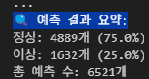
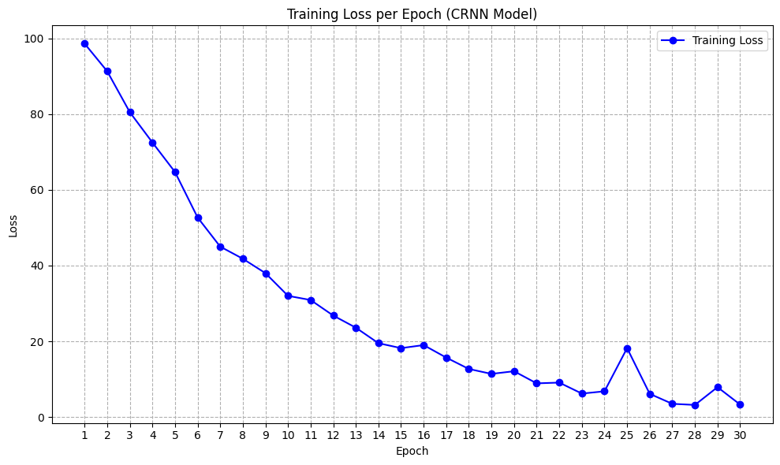

# AI-X-DL-Projects

# 기계장비에서 발생하는 음향 데이터를 이용한 이상상태 분류
# Anomaly Classification of Machine Acoustic Data Using Deep Learning
# 深層学習による機械音響データの異常状態分類

**조원 / Team / チーム**
- 임규원 (기계공학부) - limgw97@hanyang.ac.kr
- 이재룡 (기계공학부) - aszx3263@naver.com

(Option A 선택 / Option A selected / Option A選択)

---

## Background / 배경 (added) / 背景(追加情報)

This was done for **AI+X 딥러닝 (AI+X Deep Learning)**, an elective course taken in
the 2025-1 semester — the same semester as the mechanical engineering capstone
(`Recyclable-Waste-Sorting-System`) — after getting interested in machine learning
through that capstone work.

이 프로젝트는 **AI+X 딥러닝**이라는 선택 과목에서 진행했습니다. 2025-1학기,
기계공학 종합설계1(재활용품 분류 프로젝트)을 진행하던 것과 같은 학기에 그
프로젝트를 계기로 머신러닝에 흥미가 생겨서 수강했습니다.

本プロジェクトは選択科目**「AI+X 딥러닝(AI+X ディープラーニング)」**で行いました。
2025年度1学期、機械工学総合設計1(リサイクル品分類プロジェクト)を進めていたのと
同じ学期に、そのプロジェクトをきっかけに機械学習に興味を持ち履修しました。

## My role in the project / 이 프로젝트에서 내 역할 (added) / このプロジェクトでの担当(追加情報)

임규원 handled essentially all of the programming: data preprocessing, feature
extraction (Mel-spectrogram), the CRNN model implementation and training, and the
evaluation code. 이재룡 handled the research/topic selection and direction-setting
(deciding on the acoustic-anomaly-detection framing and which datasets/techniques to
consider), plus the report writing and demo video recording. This matches and expands
on the "역할 분담" section at the end of this document.

임규원이 프로그래밍 전반(데이터 전처리, 특징 추출(Mel-spectrogram), CRNN 모델
구현 및 학습, 평가 코드)을 담당했습니다. 이재룡은 자료 조사·주제 선정·방향
정리(음향 기반 이상 탐지로 방향을 잡고 어떤 데이터셋/기법을 검토할지 결정)와
보고서 작성, 시연 영상 녹화를 담당했습니다. 이 문서 맨 아래 "역할 분담" 섹션
내용과 같은 맥락이며, 조금 더 구체적으로 풀어 쓴 것입니다.

イム・ギュウォンがプログラミング全般(データ前処理、特徴抽出(Mel-spectrogram)、
CRNNモデルの実装・学習、評価コード)を担当しました。イ・ジェリョンは資料調査・
テーマ選定・方向性の整理(音響ベースの異常検知という方向性を決め、どの
データセット・手法を検討するかを決定)、レポート作成、デモ動画の撮影を
担当しました。これは本文書末尾の「役割分担」セクションと同じ内容を、より
具体的に記したものです。

---

## 1. 프로젝트 개요 및 목표 설정
## 1. Project Overview and Goal Setting
## 1. プロジェクト概要と目標設定

### 1.1 프로젝트 개요

최근 산업 현장에서는 다양한 기계장비가 고도의 자동화·지능화 과정을 거치며 사용되고 있으며, 이들 장비의 상태를 실시간으로 감지하고 이상 여부를 판단하는 기술의 중요성이 커지고 있습니다.
특히 기계의 고장은 생산 라인 전체에 영향을 미치기 때문에 조기 진단 및 예방 유지보수(Predictive Maintenance)의 필요성이 강조되고 있습니다.

기계 장비는 작동 중 고유한 음향 신호를 발생시키며, 장비 내부의 마모, 고장, 정렬 불량 등 이상 상태가 발생할 경우 이러한 음향 패턴에 미세한 변화가 감지됩니다.
**본 프로젝트는 이러한 음향 신호의 특성 변화를 분석하여 기계 장비의 정상/비정상 상태를 분류**하고자 합니다.

### 1.1 Project Overview (translation)

In recent industrial settings, various machines are increasingly automated and
intelligent, making it more important to detect equipment condition in real time and
judge whether it's abnormal. Since a machine failure can affect an entire production
line, early diagnosis and predictive maintenance are especially emphasized.

Machines emit a characteristic acoustic signal while operating, and internal issues —
wear, failure, misalignment — cause subtle changes in that acoustic pattern.
**This project analyzes changes in acoustic signal characteristics to classify a
machine's condition as normal or abnormal.**

### 1.1 プロジェクト概要(翻訳)

近年の産業現場では、さまざまな機械設備が高度に自動化・知能化される過程で使用されており、
これらの設備の状態をリアルタイムで検知し、異常の有無を判断する技術の重要性が高まっています。
特に機械の故障は生産ライン全体に影響を及ぼすため、早期診断および予防保全
(Predictive Maintenance)の必要性が強調されています。

機械設備は稼働中に固有の音響信号を発生させ、内部の摩耗、故障、アライメント不良などの
異常状態が発生すると、この音響パターンに微細な変化が検知されます。
**本プロジェクトは、この音響信号の特性変化を分析することで、機械設備の正常/異常状態を
分類する**ことを目指します。

### 1.2 문제 정의

기존 센서 기반 진동 또는 열 특성 분석 방식은 정확하지만, 설치 비용이 크고 보편적 적용이 어렵다는 한계가 있습니다.
반면, 음향 센서는 **설치가 간편하고 비접촉 진단 가능**하므로 다양한 산업 장비에 적용하기 적합합니다.

하지만 음향 데이터는 **노이즈가 많고 비정형적**이므로, 정교한 특성 추출 및 머신러닝/딥러닝 기반 분류 알고리즘이 필요합니다.

**목표**는 음향 데이터를 이용한 이상 상태 분류 시스템을 개발하고, 실험적 타당성을 검증하는 것입니다.

### 1.2 Problem Definition (translation)

Existing sensor-based vibration or thermal analysis methods are accurate but have
limitations: expensive to install and hard to apply broadly. Acoustic sensors, by
contrast, are **easy to install and allow non-contact diagnosis**, making them suitable
for a wide range of industrial equipment.

However, acoustic data is **noisy and unstructured**, so it requires careful feature
extraction and a machine learning/deep learning-based classifier.

**Goal**: build an anomaly classification system using acoustic data and validate its
experimental feasibility.

### 1.2 課題定義(翻訳)

既存のセンサーベースの振動または熱特性分析方式は正確だが、設置コストが大きく、
汎用的な適用が難しいという限界がある。一方、音響センサーは**設置が容易で非接触診断が
可能**であるため、多様な産業機器への適用に適している。

しかし、音響データは**ノイズが多く非定型**であるため、精緻な特徴抽出と機械学習/深層学習
ベースの分類アルゴリズムが必要となる。

**目標**は、音響データを用いた異常状態分類システムを開発し、実験的な妥当性を検証する
ことである。

### 1.3 프로젝트 목표

- 음향 데이터 수집 및 전처리
- 정상/이상 음향 특성 비교 및 특징 추출
- CNN 기반 분류 모델 개발
- 조기 이상 감지 기능 구현 및 산업 적용성 평가
- 스마트 팩토리 적용 가능성 제시

### 1.3 Project Goals (translation)

- Collect and preprocess acoustic data
- Compare normal/abnormal acoustic characteristics and extract features
- Develop a CNN-based classification model
- Implement early-anomaly-detection and evaluate industrial applicability
- Propose feasibility for smart-factory application

### 1.3 プロジェクト目標(翻訳)

- 音響データの収集および前処理
- 正常/異常音響特性の比較および特徴抽出
- CNNベースの分類モデル開発
- 早期異常検知機能の実装および産業適用性の評価
- スマートファクトリーへの適用可能性の提示

---

## 2. 주요 분석 단계 및 기법
## 2. Key Analysis Stages and Techniques
## 2. 主要な分析段階と手法

| 단계 | 기법 | 목적 |
|------|------|------|
| 전처리 | MFCC, Mel-Spectrogram, 정규화 등 | 음향 데이터 정리 및 특징 추출 |
| 분류 | CNN, Random Forest, KNN 등 | 이상 상태 자동 분류 |
| 차원 축소 | PCA, t-SNE | 효율 향상 및 시각화 |
| 모델 선택 | Grid Search, Cross Validation | 성능 최적화 |
| 클러스터링 (선택) | k-Means, HDBSCAN | 이상 상태 정의 전 탐색용 |

| Stage | Technique | Purpose |
|------|------|------|
| Preprocessing | MFCC, Mel-Spectrogram, normalization, etc. | Clean acoustic data and extract features |
| Classification | CNN, Random Forest, KNN, etc. | Automatically classify anomaly state |
| Dimensionality reduction | PCA, t-SNE | Improve efficiency and visualize |
| Model selection | Grid Search, Cross Validation | Optimize performance |
| Clustering (optional) | k-Means, HDBSCAN | Exploratory step before defining anomaly state |

| 段階 | 手法 | 目的 |
|------|------|------|
| 前処理 | MFCC、Mel-Spectrogramなど、正規化 | 音響データの整理および特徴抽出 |
| 分類 | CNN、Random Forest、KNNなど | 異常状態の自動分類 |
| 次元削減 | PCA、t-SNE | 効率向上および可視化 |
| モデル選択 | Grid Search、Cross Validation | 性能最適化 |
| クラスタリング(任意) | k-Means、HDBSCAN | 異常状態の定義前の探索用 |

> 참고: 회귀(Regression)는 본 프로젝트에 부적합하므로 제외하였습니다. (분류 과제이므로)
> Note: Regression was excluded as unsuitable for this project (since it's a
> classification task).
> 参考:回帰(Regression)は本プロジェクトには適さないため除外しました(分類課題のため)。

*Note on scope: the table above lists the techniques considered/available at the
planning stage. The notebook in this repo (`project.ipynb`) implements the final
chosen path only — Mel-Spectrogram feature extraction + CRNN classification — not
every technique listed here (e.g. PCA/t-SNE, Random Forest/KNN, and clustering were
considered but not used in the final pipeline).*

*범위에 대한 참고: 위 표는 기획 단계에서 검토/후보로 고려한 기법들의 목록입니다.
이 레포의 노트북(`project.ipynb`)은 최종적으로 선택한 경로(Mel-Spectrogram 특징
추출 + CRNN 분류)만 실제로 구현했으며, 표에 있는 모든 기법(PCA/t-SNE, Random
Forest/KNN, 클러스터링 등)을 다 쓴 것은 아닙니다.*

*範囲に関する補足:上記の表は企画段階で検討・候補とした手法の一覧です。本リポジトリの
ノートブック(`project.ipynb`)は最終的に選択した経路(Mel-Spectrogram特徴抽出+CRNN分類)
のみを実装しており、表に記載された全ての手法(PCA/t-SNE、Random Forest/KNN、
クラスタリングなど)を使用したわけではありません。*

---

## 3. 데이터 수집 및 전처리
## 3. Data Collection and Preprocessing
## 3. データ収集と前処理

### 3.1 데이터 수집

- 실제 장비의 정상/이상 음향 데이터 확보
- 이상 원인: 베어링 결함, 마찰 증가, 느슨함, 균열 등
- 다양한 작동 조건 반영 (속도, 하중, 온도 등)
- **공개 데이터셋 활용 가능**
  - ESC-50
  - MIMII Dataset (Hitachi)
  - CWRU Bearing Dataset
  - Amazon Lookout for Equipment

### 3.1 Data Collection (translation)

- Acquire normal/abnormal acoustic data from real equipment
- Anomaly causes: bearing defects, increased friction, looseness, cracks, etc.
- Reflect various operating conditions (speed, load, temperature, etc.)
- **Public datasets that can be used**
  - ESC-50
  - MIMII Dataset (Hitachi)
  - CWRU Bearing Dataset
  - Amazon Lookout for Equipment

### 3.1 データ収集(翻訳)

- 実際の設備の正常/異常音響データを確保
- 異常原因:ベアリング欠陥、摩擦増加、緩み、亀裂など
- 多様な稼働条件を反映(速度、荷重、温度など)
- **利用可能な公開データセット**
  - ESC-50
  - MIMII Dataset(Hitachi)
  - CWRU Bearing Dataset
  - Amazon Lookout for Equipment

### 3.2 전처리

- **노이즈 제거**: Band-pass filter, Wavelet
- **정규화**: Min-Max, Z-score
- **특징 추출**:
  - Mel-Spectrogram
  - MFCC
  - Chroma, Spectral Centroid 등
- **데이터 증강**:
  - 잡음 추가, pitch shift, time stretch 등

### 3.2 Preprocessing (translation)

- **Noise removal**: band-pass filter, wavelet
- **Normalization**: Min-Max, Z-score
- **Feature extraction**:
  - Mel-Spectrogram
  - MFCC
  - Chroma, Spectral Centroid, etc.
- **Data augmentation**:
  - adding noise, pitch shift, time stretch, etc.

### 3.2 前処理(翻訳)

- **ノイズ除去**:バンドパスフィルタ、ウェーブレット
- **正規化**:Min-Max、Z-score
- **特徴抽出**:
  - Mel-Spectrogram
  - MFCC
  - Chroma、Spectral Centroidなど
- **データ拡張**:
  - ノイズ付加、pitch shift、time stretchなど

*Note on scope: as with Section 2, this lists preprocessing options that were
considered. The actual notebook implements only Mel-Spectrogram extraction and basic
dB normalization — band-pass/wavelet denoising, MFCC/Chroma/Spectral Centroid, and
data augmentation were not implemented in the final code.*

*범위 참고: 2번 섹션과 마찬가지로, 이건 검토했던 전처리 옵션들의 목록입니다. 실제
노트북 코드는 Mel-Spectrogram 추출과 기본적인 dB 정규화만 구현했고, 밴드패스/웨이블릿
노이즈 제거, MFCC/Chroma/Spectral Centroid, 데이터 증강은 최종 코드에는 없습니다.*

*範囲に関する補足:第2章と同様、これは検討した前処理オプションの一覧です。実際の
ノートブックのコードはMel-Spectrogram抽出と基本的なdB正規化のみを実装しており、
バンドパス/ウェーブレットによるノイズ除去、MFCC/Chroma/Spectral Centroid、
データ拡張は最終コードには含まれていません。*

---

## 4. 특성 추출 및 모델링
## 4. Feature Extraction and Modeling
## 4. 特徴抽出とモデリング

### 4.1 특징 추출 및 사용 데이터셋

- MIMII Dataset 중 fan 데이터를 활용
- **Mel-Spectrogram**: 2D 이미지 형태로 변환하여 모델에 입력
- Sampling rate: 16,000Hz, Mel-bins: 64로 설정

### 4.1 Feature Extraction and Dataset Used (translation)

- Used the fan subset of the MIMII Dataset
- **Mel-Spectrogram**: converted to a 2D image-like array as model input
- Sampling rate: 16,000Hz, Mel bins: 64

### 4.1 特徴抽出と使用データセット(翻訳)

- MIMII Datasetのうちfanデータを活用
- **Mel-Spectrogram**:2D画像形式に変換してモデルへ入力
- サンプリングレート:16,000Hz、Mel-bins:64に設定

### 4.2 최종 분류 모델 (CRNN)

본 프로젝트에서는 CRNN(Convolutional Recurrent Neural Network)을 사용했습니다.

- CNN 층에서 주파수 패턴 특징을 추출
- LSTM 층을 통해 시간적 변화와 특징을 추가로 고려
- 최종 Dense 레이어를 통해 정상과 이상 상태를 분류

### 4.2 Final Classification Model (CRNN) (translation)

This project used a CRNN (Convolutional Recurrent Neural Network).

- CNN layers extract frequency-pattern features
- An LSTM layer additionally captures temporal changes
- A final Dense layer classifies normal vs. abnormal state

### 4.2 最終分類モデル(CRNN)(翻訳)

本プロジェクトではCRNN(Convolutional Recurrent Neural Network)を使用しました。

- CNN層で周波数パターンの特徴を抽出
- LSTM層により時間的変化と特徴をさらに考慮
- 最終Dense層により正常と異常状態を分類

### 4.3 학습 과정

- Loss: CrossEntropyLoss
- Optimizer: Adam (learning rate=0.001)
- Epoch: 30회 수행
  - Loss가 초기 약 98에서 최종적으로 약 3 수준으로 감소
  - 과적합(Overfitting) 징후 없이 안정적인 수렴 확인

### 4.3 Training Process (translation)

- Loss: CrossEntropyLoss
- Optimizer: Adam (learning rate=0.001)
- 30 epochs
  - Loss dropped from about 98 initially to about 3 at the end
  - Stable convergence confirmed with no signs of overfitting

### 4.3 学習プロセス(翻訳)

- Loss:CrossEntropyLoss
- Optimizer:Adam(learning rate=0.001)
- 30エポック実施
  - Lossは初期の約98から最終的に約3水準まで減少
  - 過学習(Overfitting)の兆候なく安定した収束を確認

---

## 4.4 모델 성능 평가 (추가 테스트)
## 4.4 Model Performance Evaluation (Additional Test)
## 4.4 モデル性能評価(追加テスト)

Kaggle의 [Anomaly Detection from Sound Data (Fan)](https://www.kaggle.com/datasets/vuppalaadithyasairam/anomaly-detection-from-sound-data-fan?resource=download)의 **Train Set**을 별도의 테스트 데이터로 사용하여 성능을 평가했습니다.

- 평가 데이터 총 개수: **6,521개**
- 평가 결과:
  - 정상: **4,889개 (75.0%)**
  - 이상: **1,632개 (25.0%)**

다음 이미지는 실제 평가 후 출력된 결과입니다:



Performance was evaluated using the **train set** of Kaggle's
[Anomaly Detection from Sound Data (Fan)](https://www.kaggle.com/datasets/vuppalaadithyasairam/anomaly-detection-from-sound-data-fan?resource=download)
as a separate held-out test set.

- Total evaluation clips: **6,521**
- Results:
  - Normal: **4,889 (75.0%)**
  - Abnormal: **1,632 (25.0%)**

The image above (`images/evaluation_result.png`) is the actual printed output from
this evaluation.

Kaggleの[Anomaly Detection from Sound Data (Fan)](https://www.kaggle.com/datasets/vuppalaadithyasairam/anomaly-detection-from-sound-data-fan?resource=download)
の**Train Set**を別途のテストデータとして使用し、性能を評価しました。

- 評価データ総数:**6,521件**
- 評価結果:
  - 正常:**4,889件(75.0%)**
  - 異常:**1,632件(25.0%)**

上の画像(`images/evaluation_result.png`)は実際の評価後に出力された結果です。

---

## 4.5 학습 과정에서의 손실(loss) 감소 추이
## 4.5 Loss Reduction Trend During Training
## 4.5 学習過程における損失(loss)減少の推移

다음 이미지는 실제 학습 과정 중 기록된 손실(loss) 값의 변화입니다:



epoch 26에서 일시적으로 손실값이 진동했지만 전체적인 추세는 수렴적이며 안정적으로 감소하고 있다고 볼 수 있습니다.

The image above (`images/epoch_loss.png`) shows the recorded loss values during
actual training. Loss briefly oscillated at epoch 26, but the overall trend was
convergent and can be considered a stable decrease.

上の画像(`images/epoch_loss.png`)は、実際の学習過程で記録された損失(loss)値の
変化です。epoch 26で一時的に損失値が振動しましたが、全体的な傾向は収束的であり、
安定的に減少していると見なせます。

---

## 4.6 정확도가 기대보다 낮은 이유 분석
## 4.6 Analysis of Why Accuracy Is Lower Than Expected
## 4.6 精度が期待より低い理由の分析

- 학습 데이터 양 부족 및 불균형 문제
- Mel-Spectrogram 외 추가적 특징 미활용
- 모델 구조 및 복잡도 한계
- 하이퍼파라미터 최적화 부족

- Limited/imbalanced training data
- No additional features used beyond Mel-Spectrogram
- Limits of the model architecture and complexity
- Insufficient hyperparameter tuning

- 学習データ量の不足および不均衡の問題
- Mel-Spectrogram以外の追加的な特徴量を未活用
- モデル構造および複雑度の限界
- ハイパーパラメータ最適化の不足

---

## 4.7 향후 개선 방향
## 4.7 Future Improvement Directions
## 4.7 今後の改善方向

- Transformer, Attention 기반 모델로의 확장 가능성 탐색
- 모델 경량화 및 모바일/엣지 디바이스 적용 가능성 고려
- 데이터 증강과 정교한 하이퍼파라미터 튜닝을 통한 성능 추가 향상

- Explore extending to Transformer/Attention-based models
- Consider model lightweighting and applicability to mobile/edge devices
- Further improve performance through data augmentation and finer hyperparameter tuning

- Transformer、Attentionベースのモデルへの拡張可能性を模索
- モデルの軽量化およびモバイル/エッジデバイスへの適用可能性を検討
- データ拡張とより精緻なハイパーパラメータチューニングによる性能のさらなる向上

---

## 5. 참고자료
## 5. References
## 5. 参考資料

- Amazon Lookout for Equipment: [공식 블로그 / official blog / 公式ブログ](https://aws.amazon.com/ko/blogs/korea/acoustic-anomaly-detection-using-amazon-lookout-for-equipment/)
- 공개 데이터셋 / Public datasets / 公開データセット: MIMII, CWRU 등 / etc. / など
- Python 라이브러리 / Python libraries / Pythonライブラリ: Librosa, Scipy, PyTorch

---

## 6. 결론
## 6. Conclusion
## 6. 結論

본 프로젝트에서는 CRNN 모델을 이용하여 기계 장비의 음향 데이터로 이상 상태를 분류하는 시스템을 구축하고 테스트를 진행했습니다. 비록 4.6에서 설명한 몇가지 요인 등으로 인해 정확도가 다소 하락하였지만 향후 추가적인 데이터 확보, 특징 추출의 다양화 및 고급 모델링 기법을 도입하여 정확도를 개선할 계획입니다.

This project built and tested a system that classifies machine anomaly state from
acoustic data using a CRNN model. Although accuracy was somewhat reduced due to the
factors described in Section 4.6, the plan is to improve accuracy going forward by
acquiring more data, diversifying feature extraction, and introducing more advanced
modeling techniques.

本プロジェクトでは、CRNNモデルを用いて機械設備の音響データから異常状態を分類する
システムを構築し、テストを行いました。4.6で説明したいくつかの要因により精度がやや
低下しましたが、今後は追加のデータ確保、特徴抽出の多様化、および高度なモデリング
手法の導入により精度を改善する計画です。

---

## 역할 분담
## Role Division
## 役割分担

- **멤버 1 임규원**: 코드 구현 및 데이터 처리
- **멤버 2 이재룡**: 자료 조사, 보고서 작성 및 동영상 녹화

- **Member 1, 임규원**: code implementation and data processing
- **Member 2, 이재룡**: research, report writing, and video recording

- **メンバー1 イム・ギュウォン**:コード実装およびデータ処理
- **メンバー2 イ・ジェリョン**:資料調査、レポート作成、動画撮影

---

## What this repo contains / 이 레포 구성 (added) / このリポジトリの内容(追加情報)

```
project.ipynb           Preprocessing, CRNN model, training, evaluation, and plots
crnn_mimii_fan.pth       Trained model weights
images/epoch_loss.png    Training-loss curve over 30 epochs (referenced in Section 4.5)
images/evaluation_result.png   Held-out evaluation result on the Kaggle test set (Section 4.4)
```

## Data & path notes / 데이터·경로 관련 안내 (added) / データとパスに関する注意(追加情報)

The original notebook had hardcoded local paths (`D:\AI+XDL\dataset\fan`,
`D:/AI+XDL/archive/dev_data_fan/train`) from the author's own machine. These have been
replaced with relative paths — put the MIMII fan dataset under `data/fan/<id>/{normal,
abnormal}/*.wav` and the separate evaluation clips under `data/dev_data_fan/train/`,
or adjust the paths in `project.ipynb` to wherever you keep the data. Neither dataset
is included in this repo (not source, and MIMII especially is large).

기존 노트북에는 작성자 개인 컴퓨터의 로컬 경로(`D:\AI+XDL\dataset\fan`,
`D:/AI+XDL/archive/dev_data_fan/train`)가 하드코딩돼 있었습니다. 이걸 상대경로로
바꿨습니다 — MIMII fan 데이터셋은 `data/fan/<id>/{normal,abnormal}/*.wav`
구조로, 별도 평가용 클립은 `data/dev_data_fan/train/`에 두거나, `project.ipynb`
안의 경로를 본인이 데이터를 둔 위치로 바꿔서 쓰면 됩니다. 두 데이터셋 다 이
레포에는 포함돼 있지 않습니다(소스코드가 아니고, 특히 MIMII는 용량이 큼).

元のノートブックには、作成者個人のPCのローカルパス(`D:\AI+XDL\dataset\fan`、
`D:/AI+XDL/archive/dev_data_fan/train`)がハードコーディングされていました。
これらは相対パスに置き換えています — MIMII fanデータセットは
`data/fan/<id>/{normal,abnormal}/*.wav`の構成で、別途の評価用クリップは
`data/dev_data_fan/train/`に配置するか、`project.ipynb`内のパスをご自身の
データの場所に合わせて変更してください。どちらのデータセットも本リポジトリには
含まれていません(ソースコードではなく、特にMIMIIは容量が大きいため)。

## What changed from the original repo / 원본 레포에서 바뀐 점 (added) / 元のリポジトリからの変更点(追加情報)

- Removed a duplicate cell: the notebook had two copies of `extract_mel()` back to
  back (an earlier draft, then the same function immediately followed by the actual
  data-loading loop). Kept only the complete version.
- Replaced hardcoded local paths with relative ones (see above).
- Removed decorative emoji from print statements and added Korean/Japanese/English
  comments throughout, consistent with the other repos in this cleanup series.
- This README keeps **every original section and sentence exactly as written**, with
  English/Japanese translations added alongside — nothing from the original was
  removed or condensed. Notes were added only where translation required clarifying
  which parts of Sections 2 and 3 were "considered options" vs. what the code actually
  implements.

- 중복 셀 제거: 노트북에 `extract_mel()`이 연속으로 두 번 있었습니다(초기 초안
  하나와, 그 바로 뒤에 동일한 함수 + 실제 데이터 로딩 루프가 붙은 완성본).
  완성된 쪽만 남겼습니다.
- 하드코딩된 로컬 경로를 상대경로로 교체(위 내용 참고).
- print문의 장식용 이모지를 제거하고, 이번 정리 시리즈의 다른 레포들과 일관되게
  한국어/일본어/영어 주석을 추가했습니다.
- 이 README는 **원본의 모든 섹션과 문장을 그대로 유지**하면서 영어/일본어 번역만
  옆에 추가했습니다 — 원본에서 지우거나 압축한 내용은 없습니다. 2번과 3번 섹션의
  일부가 "검토했던 후보 기법"이고 실제 코드는 그중 일부만 구현했다는 걸 명확히
  하기 위한 설명만 추가로 덧붙였습니다.

- 重複セルの削除:ノートブックに`extract_mel()`が連続して2回存在していました
  (初期草稿1つと、その直後に同一関数+実際のデータ読み込みループが続く完成版)。
  完成版のみを残しました。
- ハードコーディングされたローカルパスを相対パスに置き換え(上記参照)。
- print文の装飾的な絵文字を削除し、今回の整理シリーズの他のリポジトリと同様、
  韓国語・日本語・英語のコメントを全体に追加しました。
- このREADMEは**元のすべてのセクションと文章をそのまま維持**しつつ、英語・日本語の
  翻訳を併記しました — 元の内容から削除・圧縮したものはありません。第2章・第3章の
  一部が「検討した候補手法」であり、実際のコードはその一部のみを実装している点を
  明確にするための補足のみを追加しています。

